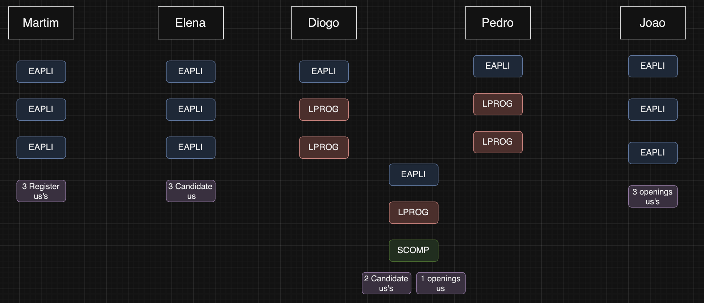

# GLOBAL DECISIONS
## Design part
For this part, we stablished some things like:
- In the Domain Model, we have to name entities and value object made of 2 words join, without space and with capital letter in each word.
- For the part of the Job Opening and Recruitment Process, we decided to use the most simple way to solved it, which we saw in class. This is having both in the same agregate, because we consider it is easier when you need info about the Recruitment Process when you are checking things in the repository of JobOpening.
- We decided to use PlantUML to create the diagrams, since from our point of view, the diagrams are more readable and easy to understand.
- We decided we will have a class SystemUser, which will be a superclass of Candidate and Customer.

## Implementation part
For this part, we established some things like:
- We will use the EAPLI framework to implement the system. We decided to use this framework because, although first we have to understand it, it is the one we are most familiar with, and we saw in moodle some examples with it that could help us.
- We started from the template eapli.base, which is a template that has some functionalities that we can use in our project.
- To test the code we will use JUnit for the most simple unit tests. However, for integration tests we would like to use Spring Boot Test, but the dependency didn't work in our project.  Then we will try it with Mockito.
- We will try to follow SOLID patterns. Specifically:
  - Dependency injection: This is used in the controller and in the services. This way we will reduce coupling.
  - Interface Segregation: This is used to separate the interfaces of the classes. We have used it for example in the repositories.
  - Single Responsibility Principle: A class should have only one job. We have tried to split in many classes.
  - Open/Closed Principle: Software entities should be open for extension but closed for modification.

## Division of work
In a meeting we decided to divide the work in the following way (not everyone have the same number of subjects of this project):

In the last Sprint Elena is in charge of US1013 and US1014 and Martim is in charge of US1002 and US2002.

## Evaluation of Ourselfs
- Elena evaluates Martin with a 4/5. The rest of the group with a 0/5.
- Martim evalutes Elena with a 19/20. The rest of the group with a 0/20.