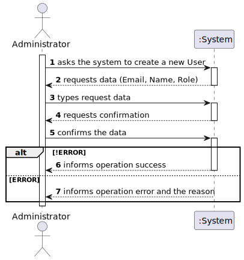
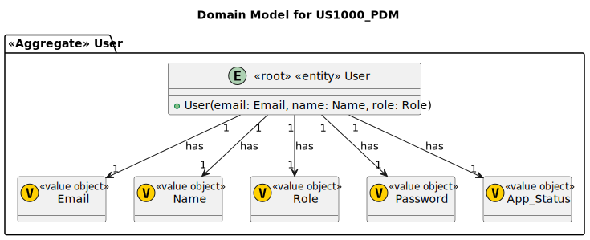
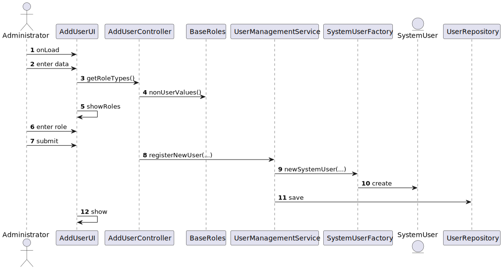
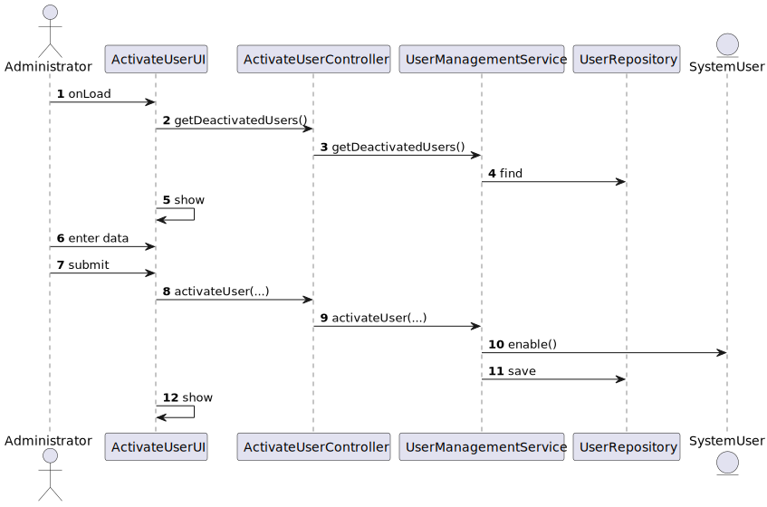
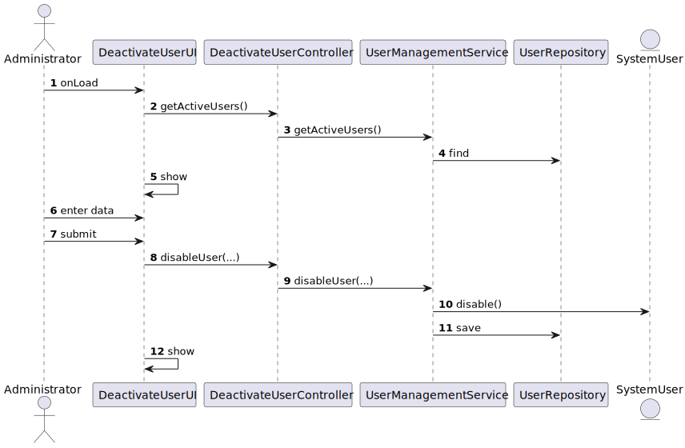
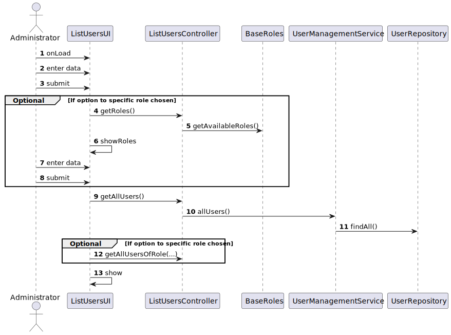
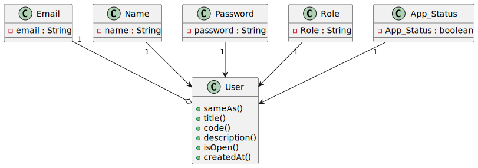

# US1000 - REGISTER, ENABLE/DISABLE AND LIST BACKOFFICE USERS
## 1. Requirements Engineering

### 1.1. User Story Description

> 1000 As Administrator, I want to be able to register, disable/enable, and list users of the backoffice
#8
### 1.2. Customer Specifications and Clarifications

**From the specifications document:**
> Alternatively this can be achieved by a bootstrap process

**From the client clarifications:**

> **Question:**
> Q57 Alejandro – Quais às politicas de negócio para registar um candidato,
quais as caracteristicas da password, email, telemóvel?
>
> **Answer:** A57. Sobre o telemóvel, seguir o Q56. Sobre email, seria qualquer email válido. Sobre a
password, podemos seguir algo como: ter no mínimo 8 caracteres, letras maiúsculas e
minúsculas, dígitos e pelo menos, um caracter não alfanumérico.

> **Question:**
>Q23 João Pinto – A mudança de estado é referente ao candidato ou à candidatura individual e como se relaciona com o 
> enable/disable dos utilizadores?

> **Answer:**
>A23 O enable/disable dos users é apenas para controlar os acessos ao sistema. O estado, no processo de candidatura,
> é o estado da candidatura de um candidato a um job opening, não está diretamente relacionado com o enable/disable dos users.

> **Question:**
>Q30 Alejandro – US2000b, o que é o enable/disable do candidato?

> **Answer:**
>A30. (alguma referencia a Q23). Refere-se a desativar o acesso do candidato ao sistema (i.e., Candidate App)

> **Question:**
>Q72 Tiago - Multiple enable/disable (US1000) – Can a user (from the backoffice, for example) be enabled/disabled multiple times?

> **Answer:**
>A72. Yes.

> **Question:**
>Q19 Diogo – Na criação de um utilizador no sistema o nome é definido pelo utilizador ou é o nome da pessoa 
> (primeiro e último) e se a password é definida pelo utilizador ou gerada pelo sistema?

> **Answer:**
>A19 (...) As US 1000 e 1001 também remetem para criação de utilizadores. Aqui, eventualmente poderia-se pensar 
> em introduzir manualmente as passwords, mas pode ser pelo mesmo mecanismo de definição automática de password, descrito anteriormente.

> **Question:**
>Q80 Sérgio – US1000 – Information about the users - Based on the user story description: "As Administrator, 
> I want to be able to register, disable/enable, and list users of the backoffice.", I have the following questions: 
> - 1 - Can there be more than one admnistrator of the backoffice? 
> - 2 - What information about the backoffice users need to be registered?

> **Answer:**
>A80. Regarding question 1, one admin is enough. Regarding question 2, see Q11.

> **Question:**
>Q11 Matilda – No enunciado não está explicita a informação a recolher para os Customers? 
> Qual a informação necessária? E quando aos funcionários da empresa?

> **Answer:**
>A11 De facto isso não está explicito. No entanto, são referidos no nome da empresa e o seu endereço no âmbito de um job opening.
>Quanto aos utilizadores (representante da empresa que acede à Customer App) eu diria que serão dados similares ao do Candidate. 
> Quando aos funcionários da empresa, eu diria que é importante garantir que é usado o email para identificar qualquer utilizador do sistema. 
> Penso que será importante para cada utilizador termos o nome completo assim como um short user name (que deverá ser único). 
> **Actualização em 2024-03-21: O Product Owner reconsiderou e decidiu que o short user name é dispensável uma vez que para autenticação dos**
> **utilizadores se deve usar apenas o email e a password.**

> **Question:**
>Q89 Fábio – US1000 - Editar dados de utilizador – É possível alterar os dados de qualquer utilizador (Customer manager, Customer, Candidate),
> depois de este ter sido criado? Se sim, que dados são passiveis de ser alterados? Cada utilizador que é criado, 
> tem como estado "activo" por defeito?

> **Answer:**
>A89. Não irei responder diretamente à questão. O product owner considera que devem usar as melhores práticas quando a esse assunto.
>A97. No contexto da US1000 deve ser possível ativar e desativar utilizadores. Suponho que por omissão devem estar ativos.

### 1.3. Acceptance Criteria

* Nothing to comment

### 1.4. Found out Dependencies

* It depends on us-G007

### 1.5 Input and Output Data

**Input Data:**

Typed data:
- User name
- User email

Selected data:
- User role

**Output Data:**

* (In)Success of the operation

### 1.6. System Sequence Diagram (SSD)

### 1.7 Other Relevant Remarks

* Passwords will be automatically generated by the system
* The system will have a default password policy
* The default status is _active_

## 2.Analysis
The construction process of the domain model is based on the client specifications, especially the nouns (for _concepts_) and verbs (for _relations_) used.

### 2.1 Partial Domain Model

## 3.Design
### 3.1 Sequence Diagram
Como os métodos de registo, ativação/desativação e listagem de utilizadores estavam presentes
na framework, a decisão de os utilizar foi tomada para a fácil implementação desta US.

#### 3.1.1 Register User

#### 3.1.2 Enable User

#### 3.1.3 Disable User

#### 3.1.4 List Users

### 3.2 Class Diagram
It will show the classes and their relationships.
