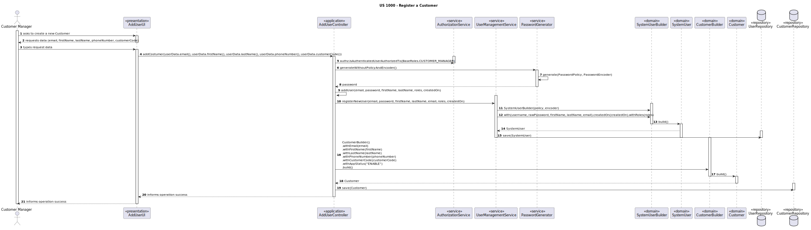

# US1001 - REGISTER A CUSTOMER
## 1. Requirements Engineering

### 1.1. User Story Description

> As Customer Manager, I want to register a customer and create a corresponding user

### 1.2. Customer Specifications and Clarifications

**From the specifications document:**
> The registration of customers for job offers is carried out by the
costumer manager.

>Both candidates and clients have specific applications (console applications) that basically
allow them to monitor applications and job offers and receive notifications about them

>	Some characteristics:
> 
>– email of the customer
> 
>– name of the customer
> 
>– phone number of the customer

**From the client clarifications:**
> **Question:** 
> Q19 Diogo – Na criação de um utilizador no sistema o nome é definido pelo utilizador ou é o nome da 
> pessoa (primeiro e último) e se a password é definida pelo utilizador ou gerada pelo sistema?
>
> **Answer:** A19 No âmbito da US 2000a o Operator cria utilizadores do sistema para candidatos que ainda 
> não estejam no sistema. Neste contexto é necessário ter uma password para esse novo utilizador. 
> Uma vez que essa informação não é transmitida pelo candidato, suponho que a solução mais “aconselhada” será 
> o sistema gerar uma password para esse utilizador. Como o utilizador/candidato irá receber essa informação 
> (a forma de autenticação na app) está out of scope, no sentido em que não existe nenhuma US que remete para isso. 
> As US 1000 e 1001 também remetem para criação de utilizadores. Aqui, eventualmente poderia-se pensar em 
> introduzir manualmente as passwords, mas pode ser pelo mesmo mecanismo de definição automática de password, descrito anteriormente.

> **Question:** 
> Q112 Rui – US1001 - É correto assumir que o customer fica automaticamente atribuido ao customer manager que o registou?
>
> **Answer:** A112 Sim. No âmbito deste projeto vamos assumir que isso deve acontecer.

> **Question:** Q56 Pina – No número de telémovel e no código postal as verificações são
feitas apenas para domínios portugueses, ou temos de programar consuante
o país referente?
>
> **Answer:**
>A56. Basta para o caso português.

> **Question:** Q11 Matilda – No enunciado não está explicita a informação a recolher para os Customers? 
> Qual a informação necessária? E quando aos funcionários da empresa?
>
>**Answer:**
>A11 De facto isso não está explicito. No entanto, são referidos no nome da empresa e o seu endereço no âmbito 
> de um job opening. Quanto aos utilizadores (representante da empresa que acede à Customer App) eu diria que 
> serão dados similares ao do Candidate. Quando aos funcionários da empresa, eu diria que é importante garantir 
> que é usado o email para identificar qualquer utilizador do sistema. Penso que será importante para cada utilizador 
> termos o nome completo assim como um short user name (que deverá ser único). 
> *Actualização em 2024-03-21: O Product Owner reconsiderou e decidiu que o short user name é dispensável uma vez que*
> *para autenticação dos utilizadores se deve usar apenas o email e a password.*

> **Question:** Q6 Matilde – Por cada Customer, apenas existe um “representante” que acede à conta (i.e., Customer App)?
>
> **Answer:**
>A6 Sim, parece-me suficiente.

> **Question:** Q22 João – Relativamente ao Job Opening (secção 2.2.2), o job reference refere que deve ser gerado pelo sistema 
> a partir de um customer code. O que é este customer code e se existe alguma regra para a sua criação?
>
> **Answer:**
>A22 Eu dira que qualquer customer terá de ter um código identificativo (único) que poderá ser uma espécie de abreviatura do seu nome. 
> Com um número limitado de caracteres. Por exemplo, para o cliente Instituto Superior de Engenharia do Porto, 
> o customer code poderia ser ISEP e não poderia haver mais nenhum customer com este customer code. Um limite razoável seria talvez 
> 8 a 10 carateres. Podemos definir 10. Este código é introduzido manualmente na criação do customer no sistema.

> **Question:** Q35 Beatriz – Customer tem que ter morada e nome da empresa ou se basta essa informação estar no job opening?
>
> **Answer:**
>A35.Devemos registar nome e morada do customer. Para cada job opening a morada pode ser especifica (e diferente da morada do customer).

> **Question:** Q135 Sofia – US1001 - Customer Code - Relativamente ao formato do customer code, em todos os exemplos fornecidos, 
> este é uma sigla/acrónimo com letras maiúsculas (ex: "ISEP", "IBM"). Só pode ter este formato ou pode conter números e letras minúsculas?
>
> **Answer:**
>A135. Ver Q22. Em Q22 sugere-se 10 caracteres no máximo. Penso que seria de manter apenas letras maiúsculas 
> podendo ainda ter dígitos (0-9), mas começando sempre por letra.

### 1.3. Acceptance Criteria

* **AC1:** Email of the costumer, Name of the costumer, Phone number and Customer Code are mandatory.
* **AC2:** Valid email address. 
* **AC3:** Verify the Phone as a portuguese number.

### 1.4. Found out Dependencies

* It depends on us-1000

### 1.5 Input and Output Data

**Input Data:**

* Typed data:
    * Email of the candidate
    * Name of the candidate
    * Phone number
    * Customer Code

**Output Data:**

* (In)Success of the operation

### 1.7 Other Relevant Remarks

* Nothing for now

## 2.Analysis
First idea of how could we treat the user story.
### 2.1. System Sequence Diagram (SSD)

## 3.Design
### 3.1 Sequence Diagram
It will show a representation of the functionalities we will implement.

### 3.2 Class Diagram
It will show the classes and their relationships.

## 4. Implementation and tests
### 4.1. Tests

### 4.2. Implementation
About the implementation, the most important thing to keep in mind is that, to create a candidate, we use first the creation of a common user.
For this reason, it share the same file for the controller and UI.