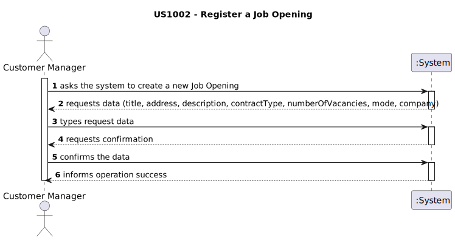
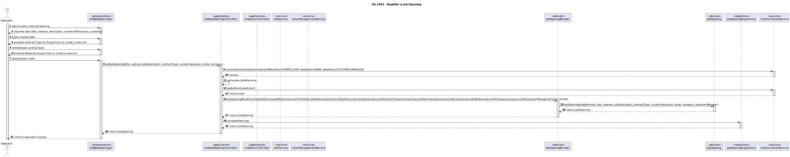

# US1002 - REGISTER A JOB OPENING
## 1. Requirements Engineering

### 1.1. User Story Description

> As Customer Manager, I want to register a job opening

### 1.2. Customer Specifications and Clarifications

**From the specifications document:**\

Job openings (or job vacancies) are created in the system by a customer manager. A job opening includes:
* **Job Reference:** A unique identifier of the job opening (generated by the system, for instance based on the customer code followed by a sequential number)
* **Title or function:** Such as "front end programmer"
* **Contract:** Type Such as full-time or part-time
* **Mode:** Such as remote, hybrid, onsite
* **Address:** Address for job
* **Company:** Customer name
* **Number of vacancies**
* **Description**
* **Requirements:** The job requirements specification to use for this opening, as described in Section 2.2.4.


**From the client clarifications:**
> **Question:** 
> Q19 Diogo – Na criação de um utilizador no sistema o nome é definido pelo utilizador ou é o nome da 
> pessoa (primeiro e último) e se a password é definida pelo utilizador ou gerada pelo sistema?
>
> **Answer:** A19 No âmbito da US 2000a o Operator cria utilizadores do sistema para candidatos que ainda 
> não estejam no sistema. Neste contexto é necessário ter uma password para esse novo utilizador. 
> Uma vez que essa informação não é transmitida pelo candidato, suponho que a solução mais “aconselhada” será 
> o sistema gerar uma password para esse utilizador. Como o utilizador/candidato irá receber essa informação 
> (a forma de autenticação na app) está out of scope, no sentido em que não existe nenhuma US que remete para isso. 
> As US 1000 e 1001 também remetem para criação de utilizadores. Aqui, eventualmente poderia-se pensar em 
> introduzir manualmente as passwords, mas pode ser pelo mesmo mecanismo de definição automática de password, descrito anteriormente.

> **Question:** 
> Q79 Padilla – US1002 - Could we use the same interview model for more than one job opening?
>
> **Answer:** A79. See Q38. Yes.

> **Question:** Q109 Varela – US1002 Modo de Trabalho e Tipo de Contrato- Numa job opening, o tipo de contrato e o modo de trabalho são 
> elementos fixos, na medida em que os tipos apresentados na documentação são estáticos e não mudam, ou poderão haver mais tipos deste 
> dois elementos?
>
> **Answer:**
>A109 Os mais “normais” serão os que aparecem na documentação. Mas penso que faz sentido o sistema aceitar outros diferentes caso o Customer Manager assim o entender.

> **Question:** Q114 Guedes – US1002 - Um customer manager tem a responsabilidade de criar job openings para os customers em que é responsável. 
> Na hora da criação da job opening, como é que ele refere qual é o customer daquela job opening? Seleciona um customer dentro dos que está responsável?
>
>**Answer:**
>A114. Sim, pode ser como indica.

> **Question:** Q115 Paula – US1002, 1007, 1009 - Na US1002 ao registar um job opening é imperativo selecionar também o job requirement e/ou as fases de recrutamento?
>
> **Answer:**
>A115. São US diferentes e, do meu ponto de vista, podem ser executadas em momentos diferentes. Apenas lembro que, como é evidente, 
> desejo que o sistema esteja sempre num estado consistente.


### 1.3. Acceptance Criteria

| Attribute           | Criteria                                                               |
|---------------------|------------------------------------------------------------------------|
| Job Reference       | Generated automatically                                                |
| Title               | Can have all letters/numbers/characters                                |
| Address             | Can have all letters/numbers and characters (i.e. 4200-100 and 1ºesq.) |
| Job Description     | Can have all letters/numbers/characters                                |
| Contract Type       | Can have all letters/numbers/characters                                |
| Number of Vacancies | Must be an integer, bigger than 0                                      |
| Mode                | Can have all letters/numbers/characters                                |
| Company             | Can have all letters/numbers/characters                                |


### 1.4. Found out Dependencies

* No dependencies found

### 1.5 Input and Output Data

**Input Data:**

* Typed data:
    * Title
    * Address
    * Description
    * Contract
    * Number of vacancies
    * Mode
    * Company


* Uploaded files:
    * None (would be the requirements, but it is not in the scope of our project)

**Output Data:**

* (In)Success of the operation

### 1.7 Other Relevant Remarks

* Nothing for now
 
## 2.Analysis
First idea of how could we treat the user story.
### 2.1. System Sequence Diagram (SSD)



## 3.Design
### 3.1 Sequence Diagram
It will show a representation of the functionalities we will implement.

### 3.2 Class Diagram
It will show the classes and their relationships.


## 4. Implementation and tests
### 4.1. Tests
```
class JobReferenceTest {

    @Test
    void shouldCreateJobReferenceWhenValidStringIsProvided() {
        String validJobReference = "JOB123";
        JobReference jobReference = JobReference.valueOf(validJobReference);
        assertEquals(validJobReference, jobReference.toString());
    }

    @Test
    void shouldThrowExceptionWhenEmptyStringIsProvided() {
        String emptyJobReference = "";
        assertThrows(IllegalArgumentException.class, () -> JobReference.valueOf(emptyJobReference));
    }

    @Test
    void shouldThrowExceptionWhenJobReferenceContainsSpaces() {
        String jobReferenceWithSpaces = "JOB 123";
        assertThrows(IllegalArgumentException.class, () -> JobReference.valueOf(jobReferenceWithSpaces));
    }

    @Test
    void shouldCompareToOtherJobReferenceCorrectly() {
        String jobReference1 = "JOB123";
        String jobReference2 = "JOB124";
        JobReference jr1 = JobReference.valueOf(jobReference1);
        JobReference jr2 = JobReference.valueOf(jobReference2);
        assertTrue(jr1.compareTo(jr2) < 0);
    }
}
```
```
class ContractTypeTest {

    @Test
    void shouldCreateContractTypeWhenValidStringIsProvided() {
        String validContractType = "ContractType1";
        ContractType contractType = ContractType.valueOf(validContractType);
        assertEquals(validContractType, contractType.toString());
    }

    @Test
    void shouldThrowExceptionWhenNullIsProvided() {
        assertThrows(IllegalArgumentException.class, () -> ContractType.valueOf(null));
    }

    @Test
    void shouldCompareToOtherContractTypeCorrectlyWhenSame() {
        String contractType1 = "ContractType1";
        ContractType ct1 = ContractType.valueOf(contractType1);
        ContractType ct2 = ContractType.valueOf(contractType1);
        assertEquals(0, ct1.compareTo(ct2));
    }

    @Test
    void shouldCompareToOtherContractTypeCorrectlyWhenDifferent() {
        String contractType1 = "ContractType1";
        String contractType2 = "ContractType2";
        ContractType ct1 = ContractType.valueOf(contractType1);
        ContractType ct2 = ContractType.valueOf(contractType2);
        assertEquals(-1, ct1.compareTo(ct2));
    }
}
```
```
class ModeTest {

    @Test
    void shouldCreateModeWhenValidStringIsProvided() {
        String validMode = "Mode1";
        Mode mode = Mode.valueOf(validMode);
        assertEquals(validMode, mode.toString());
    }

    @Test
    void shouldThrowExceptionWhenNullIsProvided() {
        assertThrows(IllegalArgumentException.class, () -> Mode.valueOf(null));
    }

    @Test
    void shouldCompareToOtherModeCorrectlyWhenSame() {
        String mode1 = "Mode1";
        Mode m1 = Mode.valueOf(mode1);
        Mode m2 = Mode.valueOf(mode1);
        assertEquals(0, m1.compareTo(m2));
    }

    @Test
    void shouldCompareToOtherModeCorrectlyWhenDifferent() {
        String mode1 = "Mode1";
        String mode2 = "Mode2";
        Mode m1 = Mode.valueOf(mode1);
        Mode m2 = Mode.valueOf(mode2);
        assertEquals(-1, m1.compareTo(m2));
    }
}
```
```
class JobOpeningTest {

    SystemUser costumerManager;
    JobOpening jobOpening;

    @BeforeEach
    public void setUp() {
        costumerManager = new SystemUserBuilder(new BasePasswordPolicy(), new PlainTextEncoder()).with("1@email.com", "Password1", "First", "Last", "1@email.com").withRoles(BaseRoles.CUSTOMER_MANAGER).build();
        jobOpening = new JobOpening(JobReference.valueOf("REF1"), "Title1", "Address1", "JobDescription1", ContractType.valueOf("ContractType1"), 1, Mode.valueOf("Mode1"), "Company1", costumerManager);
    }

    @Test
    void shouldCreateJobOpeningWithValidParameters() {
        JobReference jobReference = JobReference.valueOf("REF1");
        String title = "Title1";
        String address = "Address1";
        String jobDescription = "JobDescription1";
        ContractType contractType = ContractType.valueOf("ContractType1");
        int numberVacancies = 1;
        Mode mode = Mode.valueOf("Mode1");
        String company = "Company1";

        assertEquals(jobReference, jobOpening.jobReference());
        assertEquals(title, jobOpening.title());
        assertEquals(address, jobOpening.address());
        assertEquals(jobDescription, jobOpening.jobDescription());
        assertEquals(contractType, jobOpening.contractType());
        assertEquals(numberVacancies, jobOpening.numberVacancies());
        assertEquals(mode, jobOpening.mode());
        assertEquals(company, jobOpening.company());
        assertEquals(costumerManager, jobOpening.costumerManager());
    }

    @Test
    void shouldThrowExceptionWhenNullJobReferenceIsProvided() {
        assertThrows(IllegalArgumentException.class, () -> new JobOpening(null, "Title1", "Address1", "JobDescription1", ContractType.valueOf("ContractType1"), 1, Mode.valueOf("Mode1"), "Company1", costumerManager));
    }

    @Test
    void shouldThrowExceptionWhenNullTitleIsProvided() {
        assertThrows(IllegalArgumentException.class, () -> new JobOpening(JobReference.valueOf("REF1"), null, "Address1", "JobDescription1", ContractType.valueOf("ContractType1"), 1, Mode.valueOf("Mode1"), "Company1", costumerManager));
    }

}
```

### 4.2. Implementation
About the implementation, the most important thing to keep in mind is that, to create a candidate, we use first the creation of a common user.
For this reason, it shares the same file for the controller and UI.