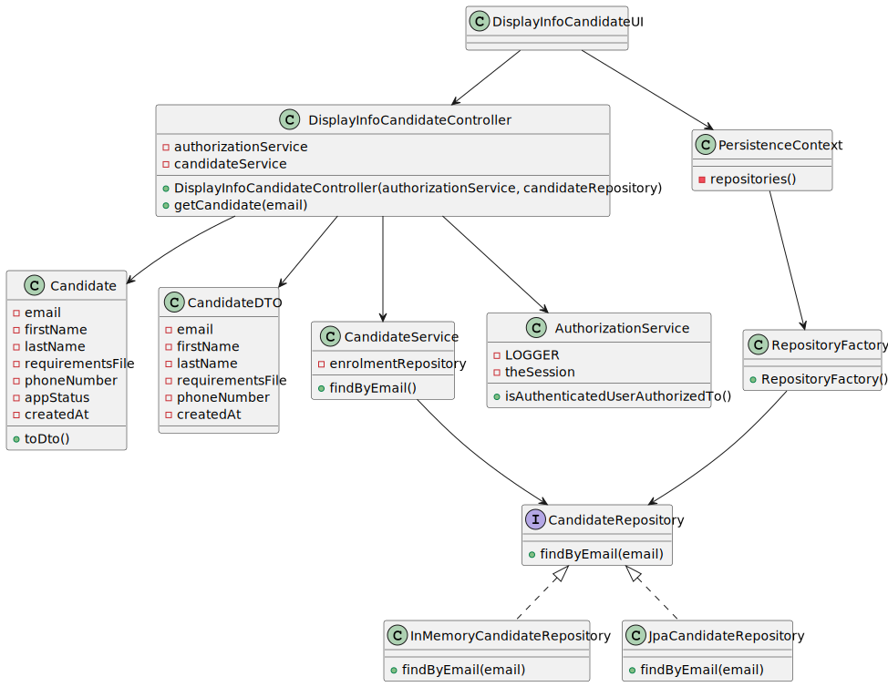

# US1006 - DISPLAY DATA OF A CANDIDATE
## 1. Requirements Engineering

### 1.1. User Story Description

> 1006 As Customer Manager, I want to display all the personal data of a candidate
#17
### 1.2. Customer Specifications and Clarifications

**From the specifications document:**
> Nothing to comment

**From the client clarifications:**
> **Question:**
> Q113 Beatriz – US1006 - Informações do candidato - Na us1006 é necessário
mostrar os dados pessoais dos candidatos. Para isso, que informações acha
pertinente demonstrar?
>
> **Answer:** 
>A113. Será toda a informação pessoal de um candidato que o sistema tenha registado.

> **Question:**
> Q90 Matilde – US1006 – Em relação ao processo de selecionar um candidato
e mostrar a sua informação pessoal, para facilitar a procura de um candidato
especifico. Faria sentido perguntar ao utilizador se quer listar todos os
candidatos existentes ou se quer reduzir a lista, selecionando um job opening
e assim mostrar todos os candidatos para esse job opening, e por fim
selecionar um candidato dessa lista mais pequena?
>
> **Answer:**
>A90. O product owner espera que o sistema aplique as melhores práticas de UI/UX mas,
não sendo especialista nessa área técnica, não arrisca sugerir soluções.

> **Question:**
>Q75 Silva – US1006 – Em relação à listagem dos dados pessoais de um
determinado candidato, um customer manager vai ter acesso a todos os
candidatos do sistema ou apenas aos candidatos que submeteram uma
application para uma job opening de um cliente que é gerido por esse
customer manager?
>
> **Answer:**
>A75. No contexto actual vamos assumir que o Customer Manager pode aceder (consultar)
os dados pessoais de qualquer candidato.

> **Question:**
>Q42 Bernado – US1006, Qual a informação do nome do candidato deve
aparecer (nome completo, primeiro e ultimo nome , etc)?
>
> **Answer:**
>A42. À partida diria que seria o nome, tal como foi recebido na application que fez (página
6, “name of the candidate”)

### 1.3. Acceptance Criteria

* Nothing to comment

### 1.4. Found out Dependencies

* It depends on us-2000a

### 1.5 Input and Output Data

**Input Data:**

* Typed data:
* Email of the candidate 

**Output Data:**

* Email of the candidate
* Name of the candidate
* Phone number
* App_status
* Requirements_file

### 1.6 Other Relevant Remarks

* Nothing for now

## 2. Analysis
### 2.1. System Sequence Diagram (SSD)

## 3. Design
### 3.1.Functionality Sequence Diagram

### 3.2. Class Diagram

## 4. Implementation and Tests
Test done with mockito for the controller.

In the implementation we can remark the creation of a DTO to show email, name, requirementsFile and phoneNumber as the client request.