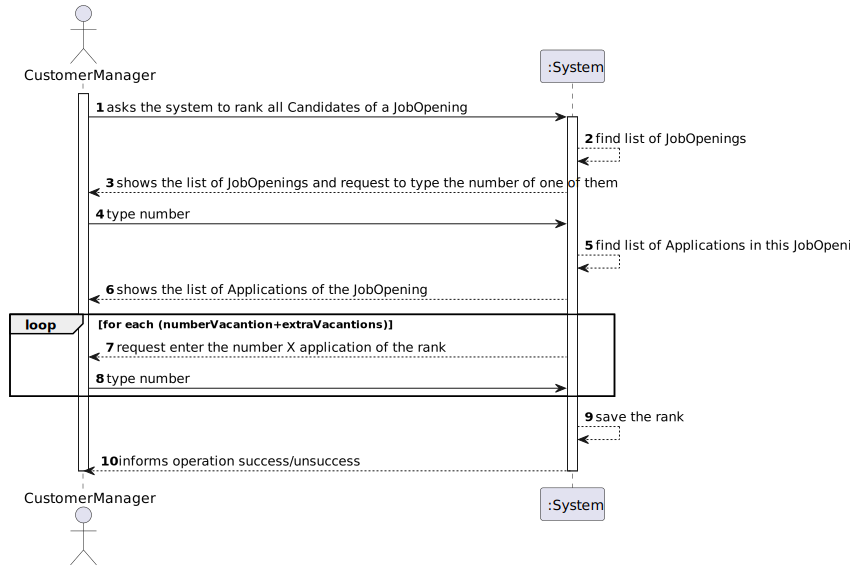
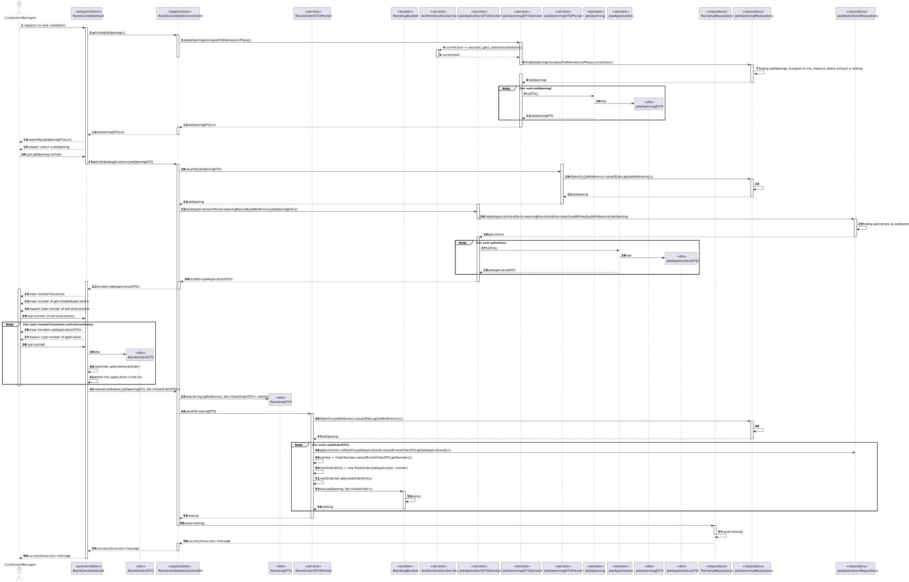
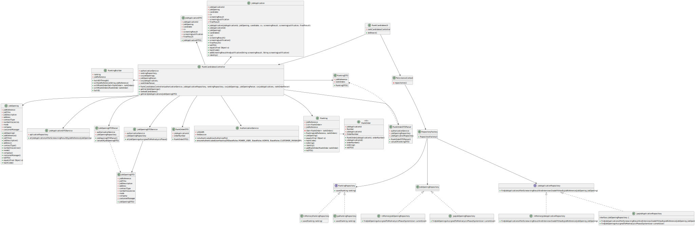
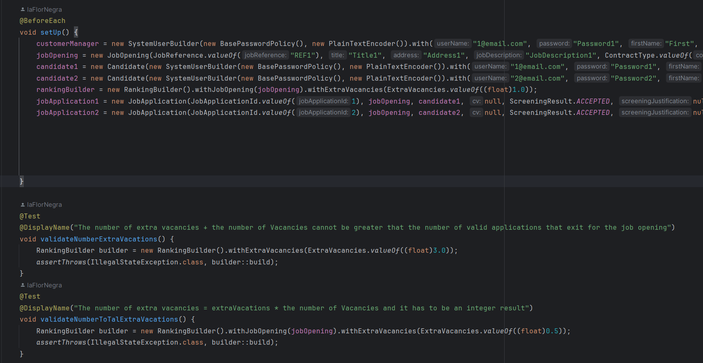
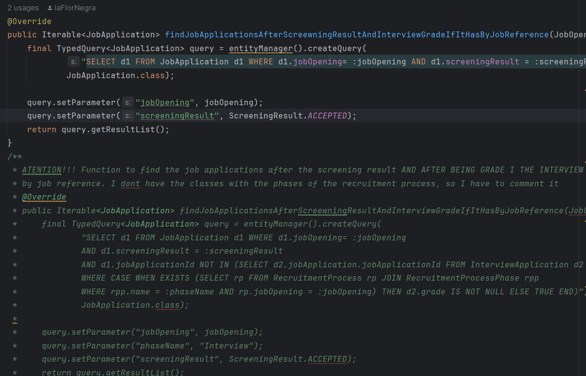

# US1013 - RANK CANDIDATES
## 1. Requirements Engineering

### 1.1. User Story Description

> 1013 As Customer Manager, I want to rank the candidates for a job opening.
ISSUE #36 in GitHub
### 1.2. Customer Specifications and Clarifications

**From the specifications document:**
> Analysis: During this phase, the applications are analyzed (using all available information like interviews and curriculum) and candidates are ranked.

**From the client clarifications:**
> **Question:**
> Q17 Beatriz – Relativamente à secção 2.2.1, é na fase de Analysis que as entrevistas são avaliadas e é esse resultado que define o ranking dos candidatos? Além disso, para que serve o CV nesta fase? Visto que as entrevistas não são obrigatórias, o que acontece quando estas não se realizam?
>
> **Answer:** 
>A17 A pontuação das entrevistas é efetuada/calculada na fase das entrevistas. O CV e outros dados (como o resultado das entrevistas) é usado pelo Customer manager na fase de analise para ordenar os candidatos. Mas a ordenação é da responsabilidade do Customer Manager (por exemplo, não tem de seguir a ordem da pontuação nas entrevistas). A US 1013 corresponde à ordenação manual dos candidatos feita pelo Customer Manager. O facto de não haver entrevistas não tem implicações na ordenação dos candidatos pois esta não depende explicitamente das entrevistas.

> **Question:**
> Q142 Varela – US1013 - Candidate Ranking – Mr Client mention a manual ranking (Q17). If the pontuation of an interview is not essential for the candidate's rank, what criteria is to be used when ranking?
>
> **Answer:**
>A142 Please view again Q17. The ranking is a decision of the Customer Manager based on all the data that he/she may have during the process (including CV and other attached documents and the interviews as well as other data/information that may not be part of the system).

> **Question:**
>Q148 Pedro – US 1013 – A minha questão é relativa a como o ranking é feito. O customer manager dá uma nota a cada candidatura e o sistema ordena por ordem crescente sendo assim atribuído o ranking de cada candidatura? Se for assim, a nota terá que escala? Caso ainda seja assim ele só pode atribuir uma nota quando tiver conhecimento de todas? Ou pode ir colocando e o ranking só é atribuído quando todas as candidaturas já estiverem avaliadas?
>
> **Answer:**
>A148 Ver Q17. A ordenação dos candidatos (ranking) é da responsabilidade do customer manager. Ele pode basear-se no resultado das entrevistas e de outra informação, mas o ranking não é automático. Não há nota nem escala a usar. As candidaturas são ordenadas.

> **Question:**
>Q155 Varela – US1013 - Rank Entries - Is there a limit on rank entries? Let's say that 100 candidates apply for a job opening. Does the Customer Manager have to sort all 100 candidates?
>
> **Answer:**
>A155 The order of candidates should include at least all the first candidates within the vacancy number and some following candidates. At the moment, I do not know exactly the number of the following candidates to be ordered. Therefore, I would like for it to be a global configuration property in the system. It could be a number representing a magnitude from the vacancy number. For instance, 1 could mean exactly the same number of vacancies, 2 the double, 0,5 half the number of vacancies. The remainder of the candidates could be just tagged as not ranked.

> **Question:**
>Q157 Miguel – US1013 - Rank the candidates for a job Opening is the same as rank the job Applications for a Job Opening, knowing that I can only know the candidates throw the job application?
>
> **Answer:**
>A157 In the context of a job opening, a candidate is someone that made an application to that job opening. But the same person can be a candidate to other job openings.

> **Question:**
>Q158 Miguel – US1013 - Process of ranking - How is the ranking done? The customer manager selects a job opening and is shown the different candidates, and they assign a rank to each one. And the ranking process end when he assigns a rank to all candidates? Example: - Rank the candidate1: - Write the rank: 3 - Rank the candidate2: - Write the rank: 1 - Rank the candidate3: - Write the rank: 4>
> **Answer:**
>A158 See Q155. Once again, I do not have specific requirements for UI/UX. But I can provide some ideas. Being a console application limits the UI/UX. However, I see this functionality similar to the way people enter recipients for an email, for instance. In the case of the recipients of an email I simply write their emails separated by a comma. Could it be similar in this case?

> **Question:**
>Q159 Miguel – US1013 - Stop the ranking process - When a customer manager starts the ranking process, he can stop and continue later? Or the ranking process must be done in one go?
> **Answer:**
>A159 See Q158. I guess it may depend on how you implement the solution. But, in the case it may work as a “long operation” be aware of when and how to conclude the “operation”.

> **Question:**
>Q160 Miguel – US1013 - Edit ranking - The customer manager can change the rank of a candidate after assigning it?>
> **Answer:**
>A160 See Q159. That should be possible if none of the interested parties were yet notified of the results.

> **Question:**
>Q162 Miguel – US1013 - When the analysis phase ends, the ranking need to have all the candidates? or can the customer manager rank only some of the candidates?
>
> **Answer:**
> A162 See Q149. All the candidates should be ranked before moving to the result phase.

> **Question:**
>Q163 Miguel – US1013 - When the customer manager is ranking the candidates, in terms of UI, should we display information from the application such as interview score, etc... or just the candidate's name and email?>
> **Answer:**
> A163 As stated before, I do not have specific requirements for the UI/UX. Use best practices. However, I would like it to be possible for the Customer Manager to have 2 or more instances of the application running, so that he/she could, for instance, see the interviews grades and, at the same time, register the order/ranking of the candidates.

> **Question:**
>Q192 Varela – US1013 – Global Configurations – I'm struggling to understang the global configurations defined for US1013. All candidates must be ranked, so that all of them can be notified. Are the global configurations only for persistence purposes? Example: all candidates are ranked and notified, so if 0.5 is in the global definition, then only half of the number of vancancies must be persisted in the system. Is this the scenario that Mr. Client has in mind?
>
> **Answer:**
> A192. I am assuming you refer to Q155. Suppose you have 2 vacancies. You have 80 candidates. If you configure the property as 1 you need to rank (record in the system) the 2 first candidates plus 2 other candidates. If the property is 0,5 you should rank the 2 first candidates plus 1 third candidate. If the property is 2, you should rank the 2 first candidates plus 4 extra candidates. This is a way to assure that you do not have to record in the system the rank of all the possible candidates, but only a number that includes the ones required to fulfill the vacancies plus some extra (according to the property) for possible exceptions (such as someone leaving the application). But my suggestion was only to help in the UI/UX. You may use any other option.

### 1.3. Acceptance Criteria

* The criteria sorting the candidates will be in charge of the Customer Manager.
* We decided that first, the customer will see a list of the JobOpenings. The customer will select one, and then, all the candidates of this JobOpening will be shown, then the system will ask one by one to enter an application in each position.
* This has to be done in the phase of Analysis of the recruitment process, because all candidates should have been evaluated in previus phases by different methods. The result phase can't begin before this ranking is done. 
* The ranking will be saved in the system.
* We should rank only the number of vacancies and a few more extraVacancies, not all applications.

### 1.4. Found out Dependencies

* It depends on us-1002 and US-1007

### 1.5 Input and Output Data

**Input Data:**

* Selected data:
* JobOpening
* JobApplication

**Output Data:**

* Success message

### 1.6 Other Relevant Remarks

* Nothing for now

## 2. Analysis
### 2.1. System Sequence Diagram (SSD)

## 3. Design
### 3.1.Functionality Sequence Diagram

### 3.2. Class Diagram

 
### 3.3. Design Decisions
First, I had an approach in which the candidates were ranked by a value object saved in the agregate JobApplication called OrderNumber. This would work, but would have problems of reliability.
For this reason, a new approach was done. In this one, we only work with one agregate: "Ranking", but the entity root Ranking, has a relation one to many with the value object "RankOrder". 
I will use DTOs with an approach of a generic DTO. This way, the Domain won't have to know the existence of many DTOs if we have many US which needs different DTOs for the same object. This way, we will look for a better maintenance for the future.

## 4. Implementation and Tests
### 4.1. Tests
The ideas we have to keep in mind is:
* The number of extra vacancies + the number of Vacancies cannot be greater that the number of valid applications that exist for the jobOpening"
* The number of extra vacancies = extraVacations * the number of Vacancies and it has to be an integer result
* The number of extra vacancies has to be greater than 0
* Should throw exception when creating OrderNumber with negative input
* Should throw exception when creating OrderNumber with zero input
* Should throw exception when creating ExtraVacancies with negative input
We have several tests for the domain. We can found them in the folder "tests" in base.core.
Examples of tests:

### 4.2. Implementation
For the implementation of this US, I have created the DTOs for the jobOpening, jobApplication and ranking and some Parsers.
Validations in the domain are done in the builder of the Ranking entity. This way, we can assure that the ranking is done correctly. Apart, we have validations in other places too, like in the UI.
In the repo I had to use commented functions and an alternative to be able to test if the program work. This is because This US depends on other US which is it not done.
Example:
