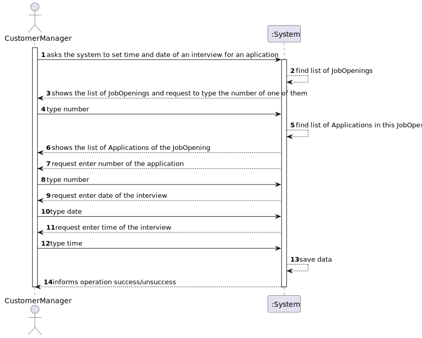
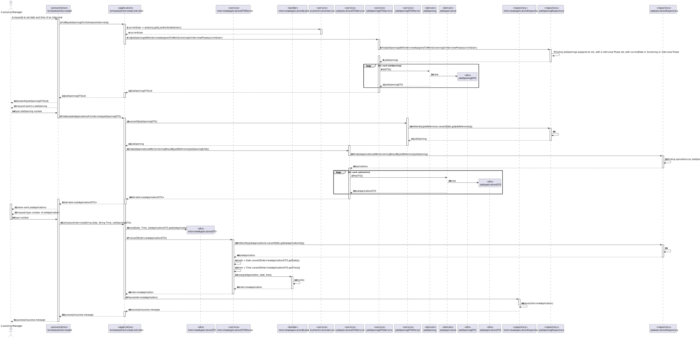
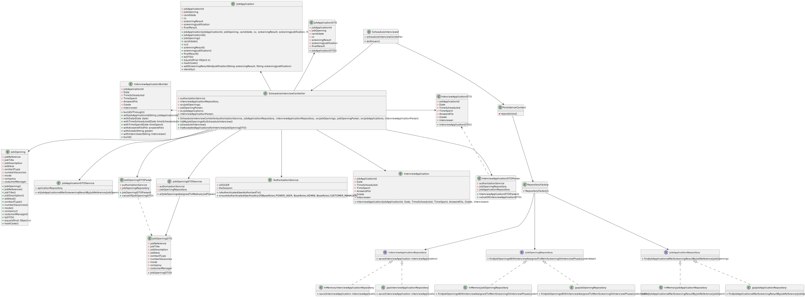
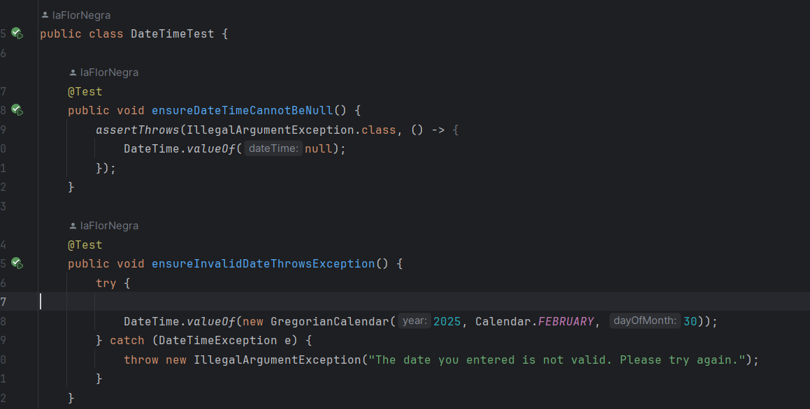
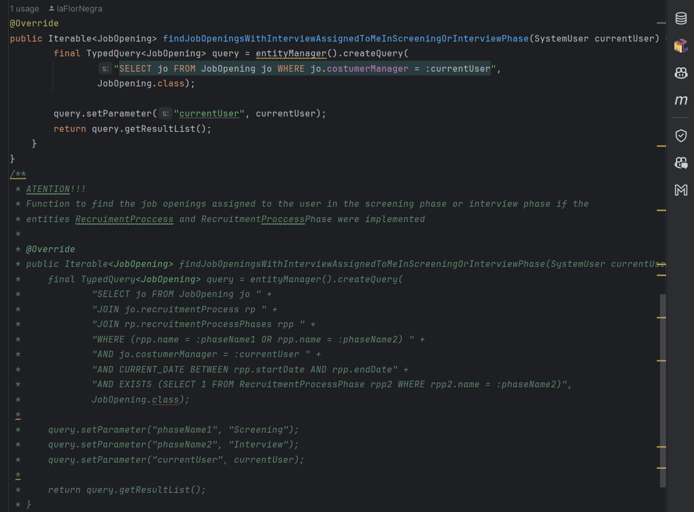

# US1014 - RECORD TIME AND DATE FOR AN INTERVIEW
## 1. Requirements Engineering

### 1.1. User Story Description

> 1014 As Customer Manager, I want to record the time and date for an interview with a candidate.
### 1.2. Customer Specifications and Clarifications

**From the specifications document:**
> Nothing to comment about the time and date.

**From the client clarifications:**
> **Question:**
>Q40 Bernardo – Uma entrevista pode ter apenas uma questão? US1014, time and date, quer dizer data de inicio e não data final? Podem haver entrevistas em paralelo? 
>
> **Answer:** 
>A40. Quanto ao número de perguntas numa entrevista, não está definido nenhum limite inferior ou superior. Ou seja, pode haver uma entrevista com apenas 1 pergunta (não fará sentido não ter perguntas). A US1014 refere-se à marcação da data de uma entrevista com um candidato. Algo como indicar o dia e a hora (ex: 23 de abril pelas 14:00). Em relação à marcação de entrevistas “sobrepostas” (com a mesma data de inicio), neste momento, seria algo a permitir (pode, por exemplo, o customer manager delegar noutra pessoa a condução da entrevista). Isso não invalida que devam validar se as entrevistas ocorrem dentro da fase das entrevistas.

> **Question:**
>Q145 Tiago – US 1014 – Em relação à marcação da intervista, só deve ser possível marcar esta data quando? Só será possível marcar a entrevista quando a fase de recrutamento se encontrar na fase de intervista? Ou será possivel marcar noutras fases anteriores? 
>
> **Answer:**
>A145 Por mim pode ser possível marcar as entrevistas antes mas deve-se ter em atenção se o candidato “passou” o screening. Não faz sentido marcar uma entrevista para um candidato que não foi aceite. Tenham em atenção este tipo de aspetos.

> **Question:**
>Q182 Ribeiro – US1014 - In the us "US 1014 - As Customer Manager, I want to record the time and date for an interview with a candidate." Is it possible to schedule interviews for any day and time or we must take into account weekends, working hours and holidays, for example?
>
> **Answer:**
>A182 The system should display the day of the week for the selected date. But the system should accept any valid date.

> **Question:**
>Q206 Luís Estebaínha – US1014- Em relação à marcação de uma entrevista com um candidato, deve ser possível marcar mais do que uma entrevista por candidatura?
>
> **Answer:**
> A206. O sistema nesta fase está pensado para apenas suportar uma entrevista por job opening por isso não faz muito sentido marcar mais do que uma entrevista para um candidato a não ser para remarcar a mesma entrevista (por exemplo, o candidato faltou justificadamente a uma entrevista anterior). Neste contexto, eu diria que faz mais sentido poder alterar a marcação de uma entrevista do que marcar mais do que uma entrevista para o mesmo candidato.

> **Question:**
>Q239 Padilha – US1014 - Should we type an interviewer because of the possible parallers interviews or should we only set the date and time of the interview for this US and use this info only for future settings of data about the interview?
>
> > **Answer:**
>A239. Please see other questions regarding this US. For the moment there is no requirement to register the name of the interviewer. However, the system should warn the user if he/she is scheduling an interview for a time already taken by other interview (for the same Customer Manager).

### 1.3. Acceptance Criteria

* We have to keep in mind that the date of the interview should be in the interview phase dates.
* We can have overlapping interviews, but the customer manager should be warned in the screen.
* We can set the date and time for the interview if the candidate passed the screening phase.
* The system should display the day of the week for the selected date.

### 1.4. Found out Dependencies

* It depends on us-2002

### 1.5 Input and Output Data

**Input Data:**
*Selected data:
* JobOpening
* JobApplication

* Typed data:
* Date
* Time

**Output Data:**

* Success message

### 1.6 Other Relevant Remarks

* Nothing for now

## 2. Analysis
### 2.1. System Sequence Diagram (SSD)

## 3. Design
### 3.1.Functionality Sequence Diagram

### 3.2. Class Diagram

### 3.3. Design Decisions
The InterviewApplication will have the same Id that the JobApplication, since they have One to One relation.
I will use DTOs with an approach of a generic DTO and a builder. This way, the Domain won't have to know the existence of many DTOs if we have many US which needs different DTOs for the same object. This way, we will look for a better maintenance for the future.

## 4. Implementation and Tests
### 4.1. Tests
The ideas we have to keep in mind is:
* The date of the interview should be in the interview phase dates. (This is not possible to test because we don't have the us of ther RecruitmentProcessPhases)
* We can have overlapping interviews, but the customer manager should be warned in the screen.
* The system should display the day of the week for the selected date.
* The date should be valid
* The Date and Time couldn't be null
* The Date has to be in the future, not in the past
Tests are done for the domain, in the folder "tests" in base.core.
Some examples are:

### 4.2. Implementation
For the implementation of this US, I have created the DTOs for the jobOpening, jobApplication and interviewApplication and builder and some Parsers.
Validations in the domain are done, but we have 1 of them which couldn't be done because to see if the date is between the period of interviews, I need the US 1007. Apart, the message shown in screen if the dates are the same is done in a service and manage in the controller, because other way we should have injected a service in the controller and although it could be a good practice, the domain would be less encapsulated.
In the repo I had to use commented functions and an alternative to be able to test if the program work. This is because This US depends on other US which is it not done.
Example:
