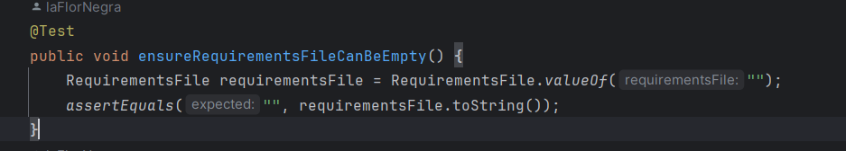

# US2000a - REGISTER A CANDIDATE
## 1. Requirements Engineering

### 1.1. User Story Description

> As Operator, I want to register a candidate and create a corresponding user

### 1.2. Customer Specifications and Clarifications

**From the specifications document:**
> The registration of candidates for job offers is carried out by the
operators (using some bots to automate the process).

>Both candidates and clients have specific applications (console applications) that basically
allow them to monitor applications and job offers and receive notifications about them

>	Some characteristics:
> 
>– email of the candidate
> 
>– name of the candidate
> 
>– phone number of the candidate

**From the client clarifications:**
> **Question:** 
> Q106 Padilla – US200a - I was thinking about if the candidate could change
his/her email. In older questions you said the email was the identificator of
the candidate, isn't it? Should we put another id made by sequence numbers
or by his NIF, for example, to identificate him/her in the system? Could we say
the same for the user who is managing the app of the customer?
>
> **Answer:** A106 The field/data that identifies the user in the system is always the email (it must be
unique). For the moment there is no need for supporting the possibility of changing the
email or add any other identification possibility.

> **Question:** 
> Q57 Alejandro – Quais às politicas de negócio para registar um candidato,
quais as caracteristicas da password, email, telemóvel?
>
> **Answer:** A57. Sobre o telemóvel, seguir o Q56. Sobre email, seria qualquer email válido. Sobre a
password, podemos seguir algo como: ter no mínimo 8 caracteres, letras maiúsculas e
minúsculas, dígitos e pelo menos, um caracter não alfanumérico.

> **Question:** Q56 Pina – No número de telémovel e no código postal as verificações são
feitas apenas para domínios portugueses, ou temos de programar consuante
o país referente?
 >
> **Answer:**
A56. Basta para o caso português.
>

> **Question:** Q54 Alejandro – Regarding the US2000a requirement which states "As an
Operator, I want to register a candidate and create a corresponding user," I
would like to know how a candidate will be registered in the system, i.e.,
understand the processes for registering a candidate. Since the candidate
has their name, email, and phone number, how should their username be
formatted to avoid conflicts with other candidates' names? Additionally, how
should the candidate be notified of their username and password?
>
>**Answer:**
>A54. There is no need for a user name (See Q11). Regarding the password, I think the
system can generate a unique password. You may assume the candidate will be informed
of his/her password by means that are outside of the scope of what is to be developed for
this version of the system.

> **Question:** Q43 Daniela – Para os candidato e para os utilizadores do sistema que
informações são necessárias?
>
>**Answer:** A43. Alguma informação anterior é referida na Q11. Para além disso a secção 2.2.3 refere
que relativamente aos candidatos temos a seguinte informação: email of the candidate,
name of the candidate, phone number of the candidate.

> **Question:** Q42 Bernado – US1006, Qual a informação do nome do candidato deve
aparecer (nome completo, primeiro e ultimo nome , etc)?
> 
>**Answer:**  A42. À partida diria que seria o nome, tal como foi recebido na application que fez (página
6, “name of the candidate”)

> **Question:** Q33 Beatriz – O candidato tem um código identificativo ou é o email que o
identifica?
>
>**Answer:**  A33. A identificação do candidato é por email. Não haverá necessidade de um código.

> **Question:** Q30 Alejandro – US2000b, o que é o enable/disable do candidato?
>
>**Answer:** A30. (alguma referencia a Q23). Refere-se a desativar o acesso do candidato ao sistema
(i.e., Candidate App)

### 1.3. Acceptance Criteria

* **AC1:** Email of the candidate,
  Name of the candidate, Phone number of the candidate are mandatories.
* **AC2:** Valid email address. 
* **AC3:** Verify the Phone as a portuguese number.
* **AC4**: Password (generated automatically): min 8 characters, capital and non-capital letters, numbers and at least one non-alphanumeric character.

### 1.4. Found out Dependencies

* It depends on us-1000

### 1.5 Input and Output Data

**Input Data:**

* Typed data:
    * Email of the candidate
    * Name of the candidate (firstName and lastName)
    * RequirementsFile (optional)
    * Phone number

**Output Data:**

* (In)Success of the operation

### 1.7 Other Relevant Remarks

* Nothing for now

## 2.Analysis
First idea of how could we treat the user story.
### 2.1. System Sequence Diagram (SSD)

## 3.Design
### 3.1 Sequence Diagram
It will show a representation of the functionalities we will implement.

### 3.2 Class Diagram
It will show the classes and their relationships.

## 4. Implementation and tests
### 4.1. Tests
I have achive to do only real JUnit test of the domain classes for this US. So I will put here some of the most importants. You can find the others in base.core.test.java.candidatemanagement.

### 4.2. Implementation
About the implementation, the most important thing to keep in mind is that, to create a candidate, we use first the creation of a common user.
For this reason, it share the same file for the controller and UI. 