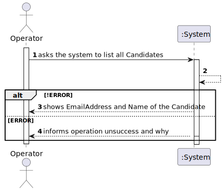
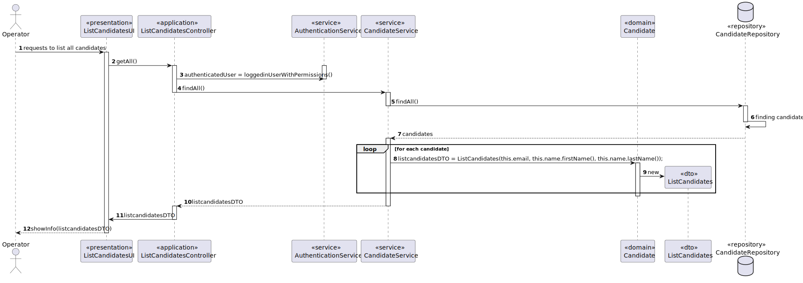
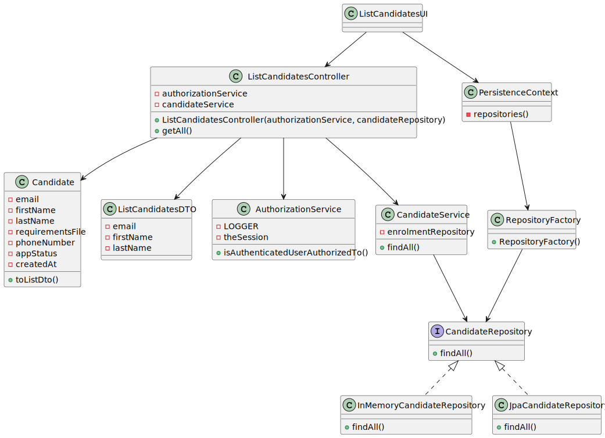
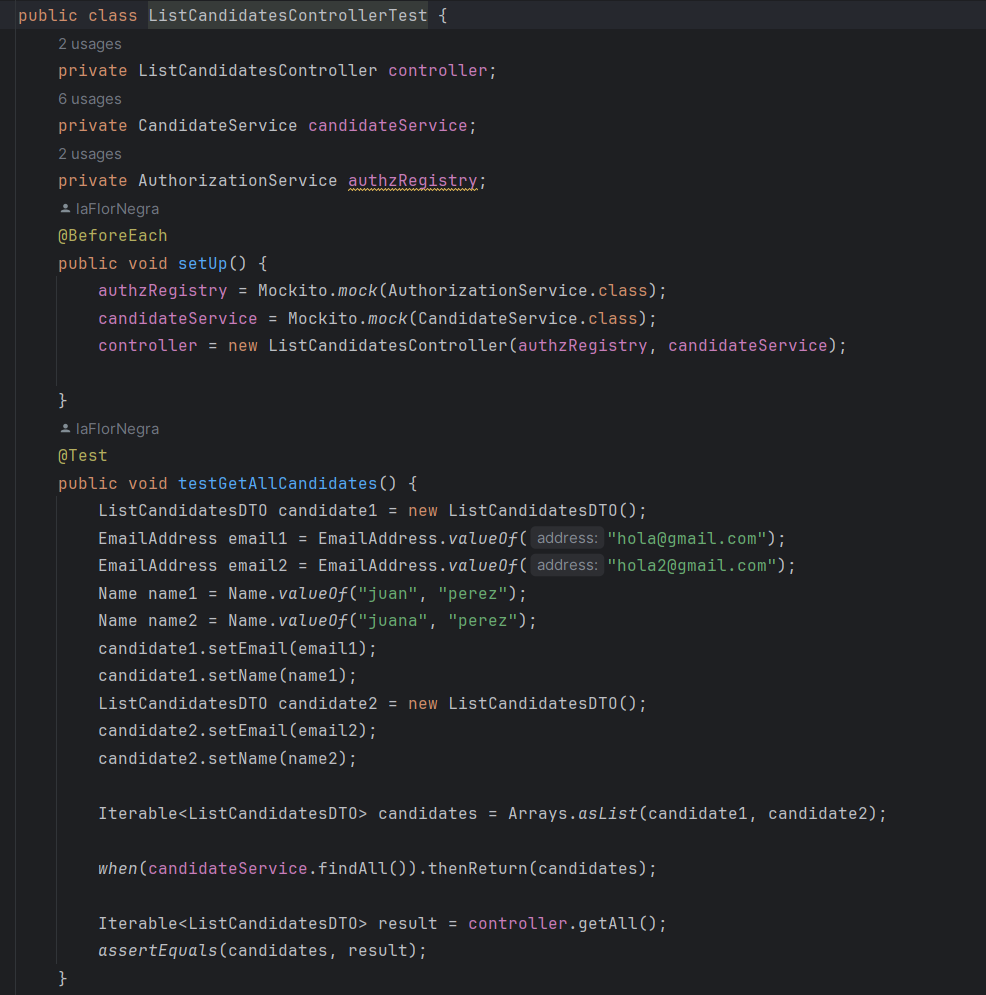

# US2000C - LIST ALL CANDIDATES
## 1. Requirements Engineering

### 1.1. User Story Description

> 2000C As Operator, I want to list all candidates.
#17
### 1.2. Customer Specifications and Clarifications

**From the specifications document:**
> Nothing to comment

**From the client clarifications:**
> **Question:**
> Q58 Alejandro – US 2000c, quando estiver a listar os candidatos basta listar os emails?
>
> **Answer:**
A58. Eu diria que faz sentido apresentar para cada candidato o seu email e o seu nome.

> **Question:**
> Q60 Alejandro – Na US 2000c, existem politicas de negócio em relação a listar os candidatos?
>
> **Answer:**
A60. Devem seguir eventuais condicionante relativas ao possível estado do candidato.

> **Question:**
>Q66 Costa – US2000c - Ordem dos candidatos. Na US 2000c é pedido que implementemos a função de listar todos os candidatos. É necessário ordenar os candidatos (por exemplo por ordem alfabética do nome)? Se for, qual é o critério que devemos seguir?
>
> **Answer:**
A66. Sim a listagem pode ser por ordem alfabética do nome.

### 1.3. Acceptance Criteria

* The list of candidates must be displayed in alphabetical order of the name.

### 1.4. Found out Dependencies

* It depends on us-2000a

### 1.5 Input and Output Data

**Input Data:**

* Nothing

**Output Data:**

* Email of the candidate
* Name of the candidate

### 1.6 Other Relevant Remarks

* Nothing for now

## 2. Analysis
### 2.1. System Sequence Diagram (SSD)

## 3. Design
### 3.1.Functionality Sequence Diagram

### 3.2. Class Diagram

## 4. Implementation and Tests
Test have been done with Mockito.

In the implementation we can remark the creation of a DTO to show only the email and name, as the client request.