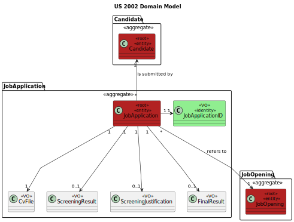

# US1002 - REGISTER A JOB OPENING
## 1. Requirements Engineering

### 1.1. User Story Description

> As Operator, I want to register an application of a candidate for a job opening and import all files received

### 1.2. Customer Specifications and Clarifications

**Teacher clarification:**
* Just upload the file to the system.

**From the specifications document:**

Candidates submit their applications for job openings by email.
There is an Applications Email Bot (outside of scope for this project) that is continuously
processing these emails. The Bot processes the emails and produces (in a predefined folder) the following content/files (using the same file prefix for files of the same application):
* A text file with the contents of the email
* A file for each file attached to the email (usually PDF files)
* A text file with the contents of each file attached to the email (processed by an OCR tool)
* A text file with the data of the application and candidate, with at least:
* - job reference
* - email of the candidate
* - name of the candidate
* - phone number of the candidate


**From the client clarifications:**
> **Question:** 
> Q15 Ricardo – É o Operador que regista uma candidatura ou é o sistema que o faz automaticamente? 
> E como integra o “plugin” de verificação da candidatura neste processo?
>
> **Answer:** A15 Na US 2002 o Operator regista a candidatura. Para isso, é o Operator que inicia o 
> processo mas o sistema deve importar os dados resultantes do Application File Bot de forma “automática” 
> (Ver References da US 2002). O plugin referido entra neste processo através da US 2003, em que o 
> Operador gera um ficheiro template com os dados a introduzir para validar uma candidatura. Na US 2004, 
> o Operador, após preencher os dados específicos da candidatura (com base no ficheiro template anterior) 
> submete no sistema esse ficheiro que vai ser usado para o sistema avaliar/verificar a candidatura. 
> Se os critérios não forem atingidos a candidatura é recusada.

> **Question:** Q24 João Pinto – Para identificar uma candidatura usa-se o id do candidato e o id do job opening?
>
> **Answer:** A24 Não é bem assim. As candidaturas vão entrar no sistema através dos ficheiros gerados pelo 
> Application Email Bot. Esses ficheiros vêm identificados pelo Job Reference seguido de um “número” que identifica 
> a candidatura a esse job reference. Será tipicamente um número sequencial. No conteúdo desses ficheiros vai aparecer 
> os dados do candidato. Repare-se que pode até o candidato ainda não existir (não ter registo no sistema).

> **Question:** 
> Q74 Tiago – US2000a – Relativamente ao registo dos candidatos, os dados devem ser inseridos manualmente 
> ou importados do ficheiro com os dados do candidato?
>
> **Answer:** A74. Faz sentido que sejam importados do ficheiro, no âmbito da US2002. Eventualmente dar a 
> possibilidade do utilizador fazer alterações, caso seja necessário.

> **Question:** Q136 Padilla – US200a, US1006 - I have understood that the registration of the candidate will 
> always be done by the operator. I also have read this line in the documentation "The Operator of the Backoffice 
> will import the files produced by the Applications File Bot and register the applications, creating candidates 
> that dot not exist in the system" So I guess the mechanism that the Operator follows is display all the data of a 
> candidate (US 1006), and if the system shows "this cadidate doesn't exit", the operator click in registering 
> candidate (US 2000A) and then he/she registers the aplication, isn't it? Apart, could the Operator upload the CV 
> of the candidate in the registering operation? or should it be done by the candidate in his/her console?
>
> **Answer:**
>A136. Please see Q74 and all the others that refer to US2002. US2002 regards the import of the files that result 
> from the Application File Bot. This import results in the creation of the respective applications in the system 
> and possible creation of candidate user if it does not exist already. This is to be done automatically, without 
> intervention of the operator. If, for some reason, the process encounters any problem (e.g., missing candidate date) 
> it should interrupt the import a log/inform the operator. There is no US for the candidate to upload his/her CV. 
> This is only done by email. Also, there is no US (apart from US2002) to import data from candidates.


### 1.3. Acceptance Criteria

| Attribute               | Criteria                                                                                                   |
|-------------------------|------------------------------------------------------------------------------------------------------------|
| Job Application Id      | Number that is obtained after the job reference in an application (i.e. "JDBC-4552", the id would be 4552) |
| Job Reference           | Obtained from a Job Opening                                                                                |
| Email                   | Email constraints                                                                                          |
| CV File                 | -------No constraints--------                                                                              |
| Screening Result        | Is an enum with 3 values (Accepted, Rejected and Waiting) with the default value of Waiting                |
| Screening justification | Can have all letters/numbers/characters                                                                    |
| Final Result            | Can have all letters/numbers/characters                                                                    |


### 1.4. Found out Dependencies

* Depends on the creation of a Job Opening (US1002)
* Depends on the process of creating a candidate (US2000A)

### 1.5 Input and Output Data

**Input Data:**

* Typed data:
    * Candidate Data Filepath
    * CV Filepath

* Uploaded files:
    * Candidate Data File
    * CV File

**Output Data:**

* (In)Success of the operation

### 1.7 Other Relevant Remarks

* Nothing for now
 
## 2.Analysis
First idea of how could we treat the user story.
### 2.1. System Sequence Diagram (SSD)


## 3.Design
### 3.1 Sequence Diagram
It will show a representation of the functionalities we will implement.

### 3.2 Class Diagram
It will show the classes and their relationships.


## 4. Implementation and tests
### 4.1. Tests
```
class JobApplicationIdTest {

    @Test
    void shouldCreateJobApplicationIdWhenValidNumberIsProvided() {
        int validJobApplicationId = 123;
        JobApplicationId jobApplicationId = JobApplicationId.valueOf(validJobApplicationId);
        assertEquals(validJobApplicationId, jobApplicationId.identity());
    }

    @Test
    void shouldThrowExceptionWhenNegativeNumberIsProvided() {
        int negativeJobApplicationId = -123;
        assertThrows(IllegalArgumentException.class, () -> JobApplicationId.valueOf(negativeJobApplicationId));
    }

    @Test
    void shouldThrowExceptionWhenZeroIsProvided() {
        int zeroJobApplicationId = 0;
        assertThrows(IllegalArgumentException.class, () -> JobApplicationId.valueOf(zeroJobApplicationId));
    }

    @Test
    void shouldCompareToOtherJobApplicationIdCorrectly() {
        int jobApplicationId1 = 123;
        int jobApplicationId2 = 124;
        JobApplicationId ja1 = JobApplicationId.valueOf(jobApplicationId1);
        JobApplicationId ja2 = JobApplicationId.valueOf(jobApplicationId2);
        assertTrue(ja1.compareTo(ja2) < 0);
    }
}
```
```
class ScreeningResultTest {

    @Test
    void shouldReturnAcceptedWhenAcceptedStringIsProvided() {
        ScreeningResult result = ScreeningResult.ACCEPTED;
        assertEquals(result, result.getResultOf("Accepted"));
    }

    @Test
    void shouldReturnRejectedWhenRejectedStringIsProvided() {
        ScreeningResult result = ScreeningResult.REJECTED;
        assertEquals(result, result.getResultOf("Rejected"));
    }

    @Test
    void shouldReturnWaitingWhenWaitingStringIsProvided() {
        ScreeningResult result = ScreeningResult.WAITING;
        assertEquals(result, result.getResultOf("Waiting"));
    }

    @Test
    void shouldThrowExceptionWhenInvalidStringIsProvided() {
        ScreeningResult result = ScreeningResult.ACCEPTED;
        assertThrows(IllegalArgumentException.class, () -> result.getResultOf("Invalid"));
    }
}
```
```
public class JobApplicationTest {
    private JobApplication jobApplication1;
    private JobApplication jobApplication2;
    private JobApplication jobApplication3;
    private JobApplication jobApplication4;

    private JobOpening jobOpening1;
    private JobOpening jobOpening2;

    private Candidate candidate1;
    private Candidate candidate2;


    @Before
    public void setUp() {
        jobOpening1 = new JobOpening(JobReference.valueOf("111"), "Title1", "Addres1", "Description1", ContractType.valueOf("FULL TIME"), 1, Mode.valueOf("PRESENCIAL"), "Company1", new SystemUserBuilder(new BasePasswordPolicy(), new PlainTextEncoder()).with("cuma@email.com", "Password1", "Custu", "Mana", "cuma@email.com").withRoles(BaseRoles.CUSTOMER_MANAGER).build());
        jobOpening2 = new JobOpening(JobReference.valueOf("222"), "Title2", "Addres2", "Description2", ContractType.valueOf("PART TIME"), 2, Mode.valueOf("REMOTE"), "Company2", new SystemUserBuilder(new BasePasswordPolicy(), new PlainTextEncoder()).with("cuma@email.com", "Password1", "Custu", "Mana", "cuma@email.com").withRoles(BaseRoles.CUSTOMER_MANAGER).build());

        candidate1 = new Candidate(new SystemUserBuilder(new BasePasswordPolicy(), new PlainTextEncoder()).with("1@email.com", "Password1", "First", "Last", "1@email.com").withRoles(BaseRoles.CANDIDATE).build(), EmailAddress.valueOf("1@email.com"), null, null, null);
        candidate2 = new Candidate(new SystemUserBuilder(new BasePasswordPolicy(), new PlainTextEncoder()).with("2@email.com", "Password2", "Second", "Last", "2@email.com").withRoles(BaseRoles.CANDIDATE).build(), EmailAddress.valueOf("2@email.com"), null, null, null);

        jobApplication1 = new JobApplication(JobApplicationId.valueOf(1), jobOpening1, candidate1, null, ScreeningResult.WAITING, null, null);
        jobApplication2 = new JobApplication(JobApplicationId.valueOf(2), jobOpening2, candidate2, null, ScreeningResult.WAITING, null, null);
        jobApplication3 = new JobApplication(JobApplicationId.valueOf(3), jobOpening1, candidate1, null, ScreeningResult.WAITING, null, null);
        jobApplication4 = new JobApplication(JobApplicationId.valueOf(2), jobOpening2, candidate2, null, ScreeningResult.WAITING, null, null);
    }

    @Test
    public void identity() {
        assertEquals(1, jobApplication1.identity().identity());
        assertEquals(2, jobApplication2.identity().identity());
        assertNotEquals(3, jobApplication4.identity().identity());
    }

    @Test
    public void testEquals() {
        assertEquals(jobApplication2, jobApplication4);
        assertEquals(jobApplication4, jobApplication2);
        assertNotEquals(jobApplication1, jobApplication2);
        assertNotEquals(jobApplication1, jobApplication3);
        assertNotEquals(jobApplication1, jobApplication4);
    }

    @Test
    public void testHashCode() {
        assertEquals(jobApplication2.hashCode(), jobApplication4.hashCode());
        assertEquals(jobApplication4.hashCode(), jobApplication2.hashCode());
        assertEquals(jobApplication1.hashCode(), jobApplication1.hashCode());
        assertNotEquals(jobApplication1.hashCode(), jobApplication2.hashCode());
        assertNotEquals(jobApplication1.hashCode(), jobApplication3.hashCode());
        assertNotEquals(jobApplication1.hashCode(), jobApplication4.hashCode());
    }

    @Test
    public void testResults() {
        assertNull(jobApplication1.FinalResult());
        assertEquals("Waiting", jobApplication1.ScreeningResult());
        assertNull(jobApplication1.ScreeningJustification());


        jobApplication1.addScreeningResultAndJustification(ScreeningResult.ACCEPTED, "Justification1");
        jobApplication1.addFinalResult("FinalResult1");

        assertEquals("Accepted", jobApplication1.ScreeningResult());
        assertEquals("Justification1", jobApplication1.ScreeningJustification());
        assertEquals("FinalResult1", jobApplication1.FinalResult());

        jobApplication2.addScreeningResultAndJustification(ScreeningResult.ACCEPTED, "Justification1");
        jobApplication2.addFinalResult("FinalResult1");

        assertEquals(jobApplication1.ScreeningResult(), jobApplication2.ScreeningResult());
        assertEquals(jobApplication1.ScreeningJustification(), jobApplication2.ScreeningJustification());
        assertEquals(jobApplication1.FinalResult(), jobApplication2.FinalResult());
    }

    @Test
    public void shouldAddScreeningResultAndJustification() {
        jobApplication1.addScreeningResultAndJustification(ScreeningResult.ACCEPTED, "Justification1");
        assertEquals("Accepted", jobApplication1.ScreeningResult());
        assertEquals("Justification1", jobApplication1.ScreeningJustification());
    }

    @Test
    public void shouldAddFinalResult() {
        jobApplication1.addFinalResult("FinalResult1");
        assertEquals("FinalResult1", jobApplication1.FinalResult());
    }

    @Test
    public void shouldNotAddScreeningResultAndJustificationWhenNull() {
        assertThrows(IllegalArgumentException.class, () -> jobApplication1.addScreeningResultAndJustification(null, null));
    }

    @Test
    public void shouldNotAddFinalResultWhenNull() {
        assertThrows(IllegalArgumentException.class, () -> jobApplication1.addFinalResult(null));
    }

}
```

### 4.2. Implementation
About the implementation, the most important thing to keep in mind is that, to create a candidate, we use first the creation of a common user.
For this reason, it shares the same file for the controller and UI.